# Travaux Pratiques — Supervision et Gestion de Réseaux
## Mise en œuvre d'une architecture complète de supervision et de sécurité

**Auteur :** Razafindrabetany Roger Marius  
**Enseignant :** Tommy Montégu  
**Formation :** ESIROI — 4A Informatique  
**Date :** Février 2026


## Table des matières

[Infrastructure du réseau](#1-infrastructure-du-réseau)
[Configuration SNMP sur les serveurs cibles](#2-configuration-snmp-sur-les-serveurs-cibles)
[Installation et configuration du serveur de supervision (srv-monitoring)](#3-installation-et-configuration-du-serveur-de-supervision)
[Installation et configuration du serveur Linux (srv-linux)](#4-installation-et-configuration-du-serveur-linux)
[Configuration du pare-feu pfSense](#5-configuration-du-pare-feu-pfsense)
[Configuration du serveur Windows (AK-DC)](#6-configuration-du-serveur-windows)
[Supervision avec Zabbix](#7-supervision-avec-zabbix)
[Supervision avancée — Sondes et alertes](#8-supervision-avancée--sondes-et-alertes)
[SIEM Wazuh — Centralisation des logs](#9-siem-wazuh--centralisation-des-logs)
[Simulation d'une attaque par force brute SSH](#10-simulation-dune-attaque-par-force-brute-ssh)
[Conclusion](#11-conclusion)


## Infrastructure du réseau

### Schéma réseau

L'infrastructure déployée dans ce TP repose sur quatre machines virtuelles hébergées sous VirtualBox, interconnectées via un réseau interne en mode Bridge sur le sous-réseau `192.168.1.0/24`. Le serveur de supervision centralise toutes les données collectées sur les autres machines.

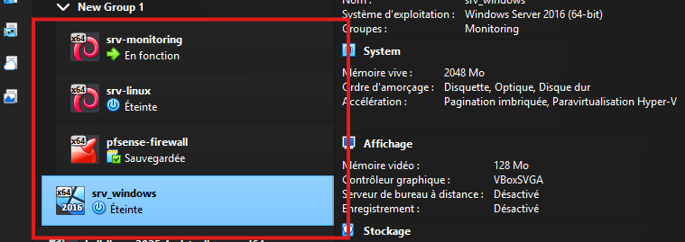
*Figure 1 — Liste des machines virtuelles déployées dans VirtualBox*

### Plan d'adressage IP

| Nom d'hôte | Rôle | Système d'exploitation | Adresse IP | Services |
|---|---|---|---|---|
| srv-monitoring | Supervision centrale + SIEM | Debian 12 (GNOME) | 192.168.1.100 | Zabbix Server, Wazuh All-in-One, Apache, MariaDB |
| srv-linux | Serveur applicatif | Debian 12 | 192.168.1.10 | Nginx (port 80), Agent Zabbix, Agent Wazuh, SNMP |
| AK-DC | Contrôleur de domaine | Windows Server 2019 | 192.168.1.11 | Active Directory, Agent Zabbix, Agent Wazuh |
| firewall | Pare-feu / Routeur | pfSense 2.7.0 | 192.168.1.1 | SNMP, Syslog vers Wazuh |

### Caractéristiques du réseau

- **Réseau :** 192.168.1.0/24
- **Masque :** 255.255.255.0
- **Plage IP :** 192.168.1.1 – 192.168.1.254
- **Type de réseau VirtualBox :** Bridge Adapter (accès au réseau physique)
- **Accès Internet :** via une deuxième interface en mode NAT (pour les téléchargements)

### Architecture de supervision

```
srv-monitoring (192.168.1.100)
  ├── Supervision via Agent Zabbix ──► srv-linux (192.168.1.10)
  ├── Supervision via Agent Zabbix ──► AK-DC (192.168.1.11)
  ├── Supervision via SNMP v2c     ──► firewall (192.168.1.1)
  ├── Collecte logs Wazuh          ──► srv-linux (agent Wazuh)
  ├── Collecte logs Wazuh          ──► AK-DC (agent Wazuh)
  └── Collecte syslog              ──► firewall (syslog UDP 514)
```


## Configuration SNMP sur les serveurs cibles

### Choix de l'outil de supervision : Zabbix

**Justification du choix :** Zabbix a été retenu pour ce TP pour les raisons suivantes :
- **Open source** et sans licence commerciale, adapté à un environnement académique.
- **Support natif de SNMP** (v1, v2c, v3) sans plugin supplémentaire.
- **Templates prêts à l'emploi** pour Linux, Windows, pfSense et équipements réseau.
- **Agent natif** léger disponible pour Linux et Windows.
- **Interface web** complète pour la configuration et la visualisation.
- **Base de données** MariaDB/MySQL nativement supportée.

Centreon aurait été une alternative viable mais requiert plus de ressources et une courbe d'apprentissage plus importante.

### SNMP sur srv-linux (192.168.1.10)

#### Installation

```bash
sudo apt update
sudo apt install snmpd snmp -y
```

#### Configuration de `/etc/snmp/snmpd.conf`

```ini
# Écouter sur toutes les interfaces
agentAddress udp:161,udp6:[::1]:161

# Communauté en lecture seule accessible depuis le réseau de supervision
rocommunity public 192.168.1.0/24

# Informations système
sysLocation "Sitting on the Dock of the Bay"
sysContact "Me <admin@esiroi.local>"
```

#### Démarrage et vérification

```bash
sudo systemctl restart snmpd
sudo systemctl enable snmpd
sudo netstat -tuln | grep 161
```

#### Test de connectivité et SNMP

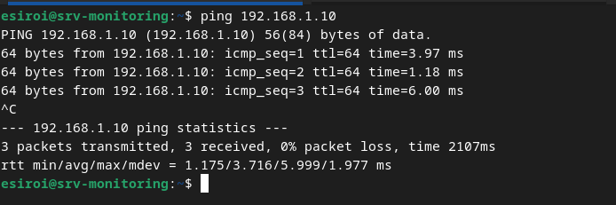
*Figure 2 — Test de connectivité (ping) entre srv-monitoring et srv-linux*

#### Test snmpwalk depuis srv-monitoring

```bash
snmpwalk -v 2c -c public 192.168.1.10
```

**Résultat obtenu :**
```
iso.3.6.1.2.1.1.1.0 = STRING: "Linux srv-linux 6.1.0-43-amd64 #1 SMP PREEMPT_DYNAMIC Debian 6.1.162-1 (2026-02-08) x86_64"
iso.3.6.1.2.1.1.5.0 = STRING: "srv-linux"
...
```

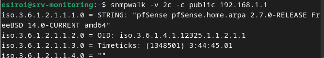
*Figure 3 — Résultat du snmpwalk sur le firewall pfSense*

### SNMP sur pfSense (192.168.1.1)

La configuration SNMP sur pfSense s'effectue via l'interface web :

1. Naviguer vers **Services → SNMP**
2. Cocher **Enable the SNMP Daemon**
3. Configurer :
   - **Polling Port :** 161
   - **System Location :** ESIROI
   - **System Contact :** admin@esiroi.local
   - **Community String :** `public`
   - **Bind Interfaces :** LAN

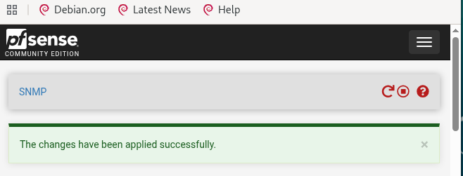
*Figure 4 — Interface SNMP activée sur pfSense*

**Test de validation :**

```bash
snmpwalk -v 2c -c public 192.168.1.1
# iso.3.6.1.2.1.1.1.0 = STRING: "pfSense pfSense.home.arpa 2.7.0-RELEASE FreeBSD 14.0-CURRENT amd64"
```


## Installation et configuration du serveur de supervision

### Prérequis — Système d'exploitation

| Paramètre | Valeur |
|---|---|
| OS | Debian GNU/Linux 12 (Bookworm) |
| Interface graphique | GNOME (task-gnome-desktop) |
| RAM | 4 Go |
| Stockage | 50 Go |
| Réseau | Bridge Adapter (192.168.1.100) + NAT (Internet) |

**Note importante :** Après l'installation de GNOME, NetworkManager a été désactivé pour éviter tout conflit avec systemd-networkd déjà en place :

```bash
sudo systemctl stop NetworkManager
sudo systemctl disable NetworkManager
sudo systemctl restart systemd-networkd
```

### Installation de MariaDB

```bash
sudo apt install -y mariadb-server
sudo systemctl start mariadb
sudo systemctl enable mariadb
sudo mysql_secure_installation
```

#### Création de la base de données Zabbix

```sql
CREATE DATABASE zabbix CHARACTER SET utf8mb4 COLLATE utf8mb4_bin;
CREATE USER 'zabbix'@'localhost' IDENTIFIED BY 'MotDePasseFort123!';
GRANT ALL PRIVILEGES ON zabbix.* TO 'zabbix'@'localhost';
SET GLOBAL log_bin_trust_function_creators = 1;
QUIT;
```

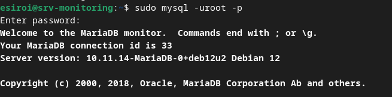
*Figure 5 — MariaDB installé et opérationnel*

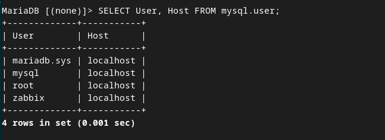
*Figure 6 — Schéma de la base de données Zabbix importé*

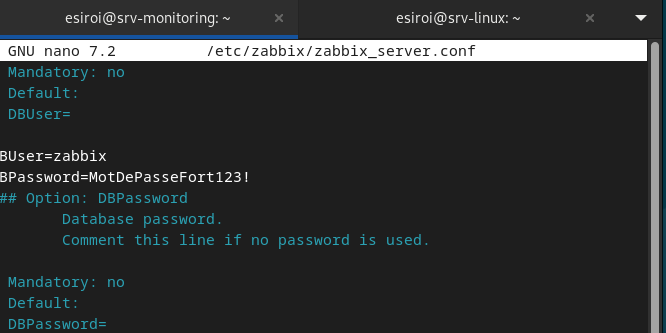
*Figure 7 — Mot de passe de la base de données configuré dans zabbix_server.conf*

### Installation de Zabbix Server

#### Ajout du dépôt Zabbix 6.4

```bash
wget https://repo.zabbix.com/zabbix/6.4/debian/pool/main/z/zabbix-release/zabbix-release_6.4-1+debian12_all.deb
sudo dpkg -i zabbix-release_6.4-1+debian12_all.deb
sudo apt update
```

#### Installation des composants

```bash
sudo apt install -y zabbix-server-mysql zabbix-frontend-php zabbix-apache-conf zabbix-sql-scripts zabbix-agent
```

#### Import du schéma initial

```bash
sudo zcat /usr/share/zabbix-sql-scripts/mysql/server.sql.gz | mysql -uzabbix -p zabbix
sudo mysql -uroot -p -e "SET GLOBAL log_bin_trust_function_creators = 0;"
```

#### Configuration de `/etc/zabbix/zabbix_server.conf`

```ini
DBPassword=MotDePasseFort123!
```

#### Démarrage des services

```bash
sudo systemctl restart zabbix-server zabbix-agent apache2
sudo systemctl enable zabbix-server zabbix-agent apache2
```

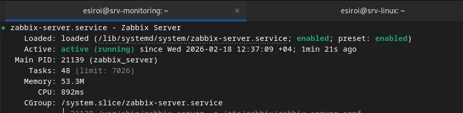
*Figure 8 — Service Zabbix Server actif et activé au démarrage*

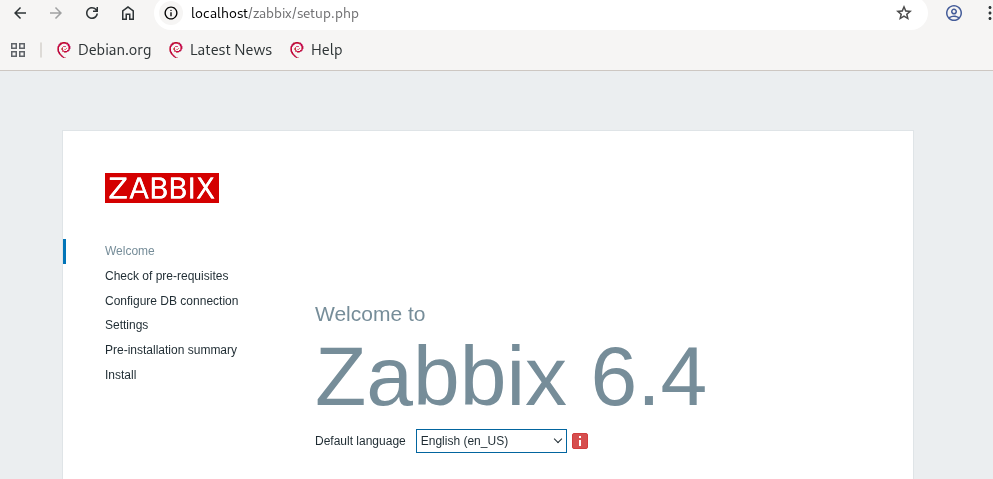
*Figure 9 — Interface web Zabbix accessible à `http://192.168.1.100/zabbix`*


## Installation et configuration du serveur Linux

### Prérequis

| Paramètre | Valeur |
|---|---|
| OS | Debian GNU/Linux 12 (Bookworm) |
| RAM | 2 Go |
| Stockage | 20 Go |
| Adresse IP | 192.168.1.10 (statique via systemd-networkd) |
| Passerelle | 192.168.1.1 |

### Configuration de l'adresse IP statique

```bash
# /etc/systemd/network/10-static.network
[Match]
Name=enp0s8

[Network]
Address=192.168.1.10/24
Gateway=192.168.1.1
DNS=8.8.8.8
```

```bash
sudo systemctl restart systemd-networkd
ip addr show enp0s8
```

### Installation de Nginx (serveur web port 80)

```bash
sudo apt update
sudo apt install -y nginx
sudo systemctl start nginx
sudo systemctl enable nginx
sudo ss -tlnp | grep :80
```

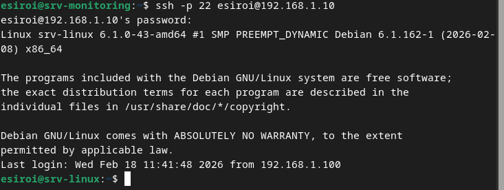
*Figure 10 — Accès SSH depuis srv-monitoring vers srv-linux*

### Installation de l'agent Zabbix

```bash
wget https://repo.zabbix.com/zabbix/6.4/debian/pool/main/z/zabbix-release/zabbix-release_6.4-1+debian12_all.deb
sudo dpkg -i zabbix-release_6.4-1+debian12_all.deb
sudo apt update
sudo apt install -y zabbix-agent
```

#### Configuration de `/etc/zabbix/zabbix_agentd.conf`

```ini
Server=192.168.1.100
ServerActive=192.168.1.100
Hostname=srv-linux
```

```bash
sudo systemctl restart zabbix-agent
sudo systemctl enable zabbix-agent
```

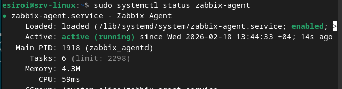
*Figure 11 — Agent Zabbix actif sur srv-linux*

#### Vérification depuis srv-monitoring

```bash
sudo apt install zabbix-get -y
zabbix_get -s 192.168.1.10 -k system.hostname
# Résultat : srv-linux
```

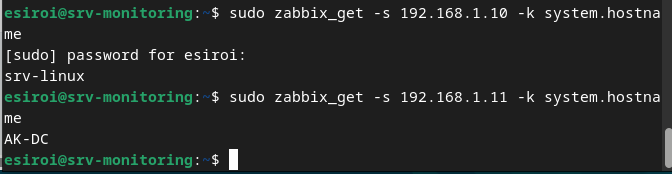
*Figure 12 — Résultat de `zabbix_get` confirmant la communication avec l'agent*

### Installation de l'agent Wazuh

```bash
curl -s https://packages.wazuh.com/key/GPG-KEY-WAZUH | sudo apt-key add -
echo "deb https://packages.wazuh.com/4.x/apt/ stable main" | sudo tee /etc/apt/sources.list.d/wazuh.list
sudo apt update
sudo apt install -y wazuh-agent
```

#### Configuration de `/var/ossec/etc/ossec.conf`

```xml
<client>
  <server>
    <address>192.168.1.100</address>
    <port>1514</port>
    <protocol>tcp</protocol>
  </server>
</client>
```

```bash
sudo systemctl start wazuh-agent
sudo systemctl enable wazuh-agent
sudo systemctl status wazuh-agent
```

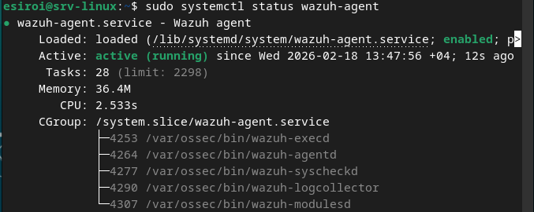
*Figure 13 — Agent Wazuh v4.7.5 actif sur srv-linux*


## Configuration du pare-feu pfSense

### Prérequis

| Paramètre | Valeur |
|---|---|
| OS | pfSense 2.7.0-RELEASE (FreeBSD 14.0-CURRENT) |
| RAM | 1 Go |
| Stockage | 12 Go |
| Interface WAN | 192.168.1.1/24 (Bridge) |

### Accès à l'interface web

L'interface d'administration est accessible via :

```
http://192.168.1.1
Utilisateur : admin
Mot de passe : pfsense
```

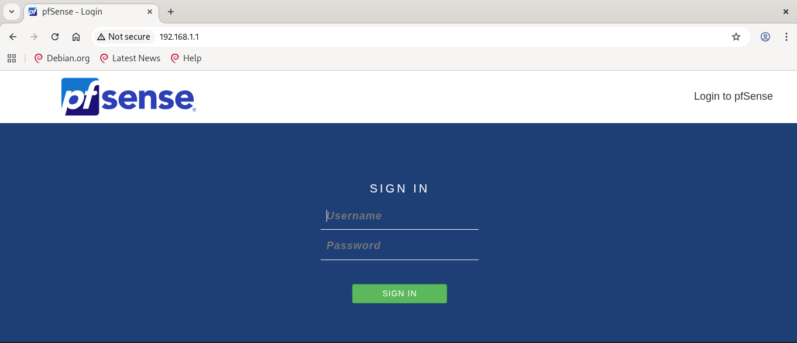
*Figure 14 — Page de connexion à l'interface web pfSense*

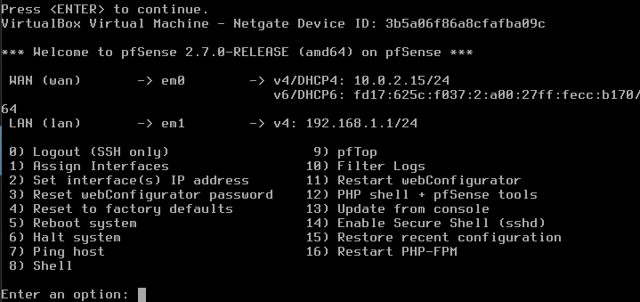
*Figure 15 — Interface console pfSense (accès terminal)*

### Configuration SNMP

Voir section 2.3.

### Configuration du transfert de logs vers Wazuh (Syslog)

Depuis l'interface web pfSense :

1. **Status → System Logs → Settings**
2. Activer **Send log messages to remote syslog server**
3. Configurer :
   - **IP address :** 192.168.1.100
   - **Port :** 514
   - **Protocol :** UDP
   - **Remote Syslog Contents :** System Events, Firewall Events

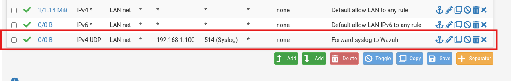
*Figure 16 — Règle de pare-feu autorisant le transfert syslog UDP/514 vers srv-monitoring*


## Configuration du serveur Windows

### Prérequis

| Paramètre | Valeur |
|---|---|
| OS | Windows Server 2019 (version 10.0.17763) |
| Nom d'hôte | AK-DC |
| RAM | 4 Go |
| Stockage | 60 Go |
| Adresse IP | 192.168.1.11 (statique) |
| Rôle | Active Directory Domain Controller |

### Installation de l'agent Zabbix

L'agent Zabbix 6.4 pour Windows a été téléchargé depuis le site officiel et installé via l'installateur MSI.

**Configuration dans `zabbix_agentd.conf` :**

```ini
Server=192.168.1.100
ServerActive=192.168.1.100
Hostname=AK-DC
```

**Démarrage du service :**

```powershell
Start-Service "Zabbix Agent"
Get-Service -Name "*zabbix*"
```

**Vérification depuis srv-monitoring :**

```bash
zabbix_get -s AK-DC -k system.hostname
# Résultat : AK-DC

zabbix_get -s AK-DC -k agent.version
# Résultat : 6.4.0

zabbix_get -s AK-DC -k agent.ping
# Résultat : 1
```

### Installation de l'agent Wazuh

L'agent Wazuh 4.7.5 pour Windows a été installé via le fichier MSI :

```powershell
msiexec /i "$env:TEMP\wazuh-agent.msi" /q WAZUH_MANAGER="192.168.1.100" WAZUH_REGISTRATION_SERVER="192.168.1.100" PROTOCOL=tcp
```

**Emplacement de l'installation :** `C:\Program Files (x86)\ossec-agent\`

**Fichier de configuration :** `C:\Program Files (x86)\ossec-agent\ossec.conf`

```xml
<client>
  <server>
    <address>192.168.1.100</address>
    <manager_address>192.168.1.100</manager_address>
  </server>
</client>
```

**Démarrage du service :**

```powershell
Start-Service -Name "WazuhSvc"
Get-Service -Name "WazuhSvc"
# Status: Running
```

**Vérification des logs de l'agent :**

```powershell
Get-Content "C:\Program Files (x86)\ossec-agent\ossec.log" -Tail 20
# 2026/02/19 01:35:32 wazuh-agent: INFO: Started (pid: 3032).
# 2026/02/19 01:35:32 wazuh-modulesd:syscollector: INFO: Module started.
```


## Supervision avec Zabbix

### Ajout des hôtes dans Zabbix

Depuis l'interface web `http://192.168.1.100/zabbix` (Configuration → Hôtes → Créer un hôte) :

| Nom d'hôte | Interface | Type | Port | Template |
|---|---|---|---|---|
| srv-linux | 192.168.1.10 | Agent Zabbix | 10050 | Linux by Zabbix agent |
| AK-DC | 192.168.1.11 | Agent Zabbix | 10050 | Windows by Zabbix agent |
| Firewall | 192.168.1.1 | SNMPv2c | 161 | Generic SNMP / pfSense by SNMP |

**Macro SNMP pour le firewall :**

```
{$SNMP_COMMUNITY} = public
```

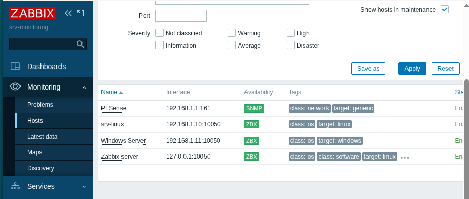
*Figure 17 — Les 3 hôtes supervisés dans Zabbix : srv-linux, AK-DC et firewall*

### Vérification de la connectivité

```bash
# Depuis srv-monitoring
zabbix_get -s 192.168.1.10 -k system.hostname   # → srv-linux
zabbix_get -s AK-DC -k agent.ping               # → 1
zabbix_get -s AK-DC -k agent.version            # → 6.4.0
snmpwalk -v 2c -c public 192.168.1.1             # → pfSense info
snmpwalk -v 2c -c public 192.168.1.10            # → Linux srv-linux info
```

### Supervision SNMP avancée du firewall

Un item SNMP a été configuré pour surveiller le trafic de l'interface WAN du firewall :

- **Nom :** Interface WAN traffic
- **Type :** SNMP v2c
- **OID :** `.1.3.6.1.2.1.2.2.1.10.1` (octets entrants)
- **Unité :** B
- **Intervalle :** 60s

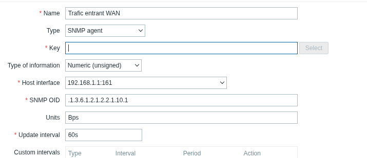
*Figure 18 — Configuration de l'item SNMP pour surveiller le trafic de l'interface WAN*

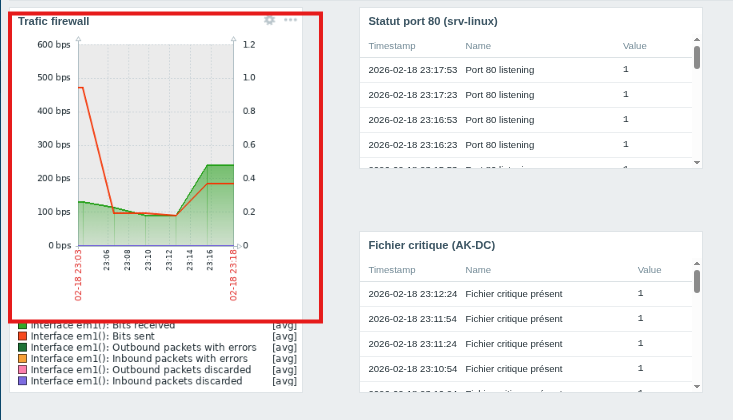
*Figure 19 — Trafic réseau visible dans Zabbix après un flood ping sur l'interface WAN*


## Supervision avancée — Sondes et alertes

### Supervision du port 80 (srv-linux)

#### Objectif

Détecter en temps réel si le service web Nginx est arrêté sur srv-linux et lever une alerte.

#### Création de l'item

Dans **Configuration → Hôtes → srv-linux → Items → Create item** :

| Paramètre | Valeur |
|---|---|
| Nom | Port 80 listening |
| Type | Zabbix agent |
| Clé | `net.tcp.listen[80]` |
| Type d'information | Numeric (unsigned) |
| Intervalle | 30s |

La clé `net.tcp.listen[80]` retourne `1` si le port est en écoute, `0` sinon.

#### Création du trigger

| Paramètre | Valeur |
|---|---|
| Nom | Port 80 is down on srv-linux |
| Sévérité | High |
| Expression | `last(/srv-linux/net.tcp.listen[80])=0` |

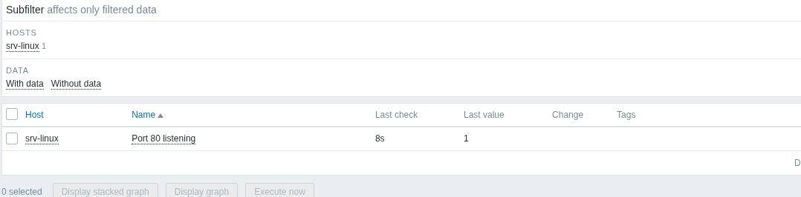
*Figure 20 — Valeur de l'item `net.tcp.listen[80]` visible dans "Latest data" (valeur = 1, port actif)*

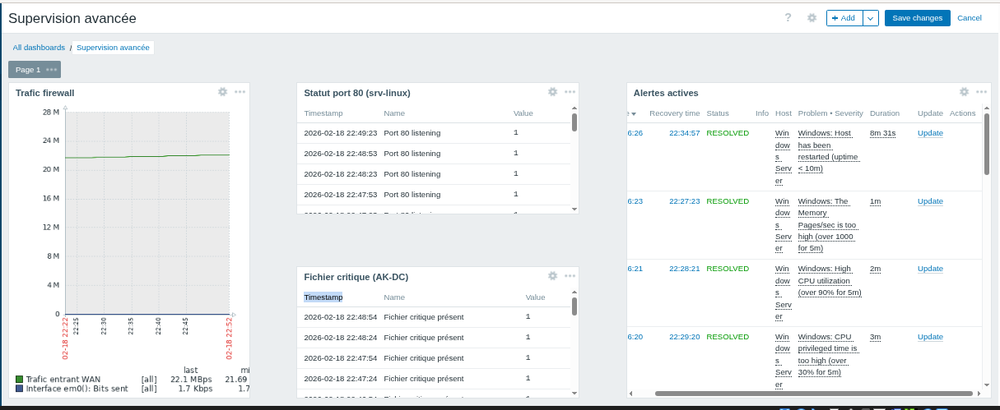
*Figure 21 — Dashboard Zabbix avant la simulation — aucune alerte active*

#### Simulation de l'arrêt du service

```bash
# Sur srv-linux
sudo systemctl stop nginx
```

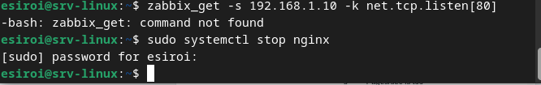
*Figure 22 — Arrêt du service Nginx via `systemctl stop nginx`*

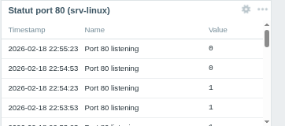
*Figure 23 — Alerte déclenchée dans Zabbix : l'item passe à 0, le trigger se déclenche*

```bash
# Redémarrage
sudo systemctl start nginx
```

### Supervision de la présence d'un fichier critique (AK-DC/Windows)

#### Objectif

Détecter la suppression d'un fichier critique sur le contrôleur de domaine Windows et envoyer une alerte.

#### Création du fichier surveillé

Sur AK-DC (PowerShell, en admin) :

```powershell
New-Item -ItemType Directory -Path "C:\Supervision\" -Force
New-Item -ItemType File -Path "C:\Supervision\fichier_critique.txt" `
    -Value "Fichier de supervision ESIROI - NE PAS SUPPRIMER"
```

#### Configuration de l'agent Zabbix (UserParameter)

Dans `C:\Program Files\Zabbix Agent\zabbix_agentd.conf` :

```ini
UserParameter=check.file.exists[*],powershell -Command "if (Test-Path -Path '$1') { echo 1 } else { echo 0 }"
```

Redémarrer le service après modification :

```powershell
Restart-Service "Zabbix Agent"
```

#### Création de l'item

| Paramètre | Valeur |
|---|---|
| Nom | Fichier critique présent |
| Type | Zabbix agent |
| Clé | `vfs.file.exists[C:\Supervision\fichier_critique.txt]` |
| Type d'information | Numeric (unsigned) |
| Intervalle | 30s |

#### Création du trigger

| Paramètre | Valeur |
|---|---|
| Nom | Fichier critique absent sur AK-DC |
| Sévérité | High |
| Expression | `last(/AK-DC/vfs.file.exists[C:\Supervision\fichier_critique.txt])=0` |

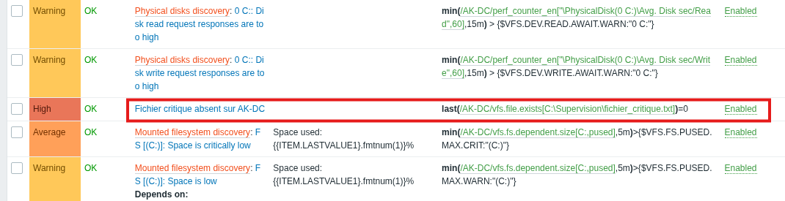
*Figure 24 — Règle de trigger configurée pour détecter l'absence du fichier critique*

#### Test et simulation

```powershell
# Simuler la suppression
Remove-Item C:\Supervision\fichier_critique.txt -Force
```

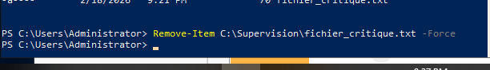
*Figure 25 — Suppression du fichier critique `C:\Supervision\fichier_critique.txt`*

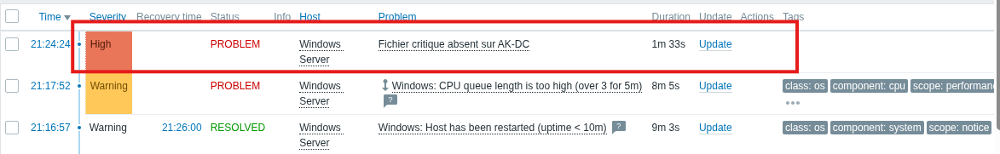
*Figure 26 — Alerte de niveau "High" déclenchée dans Zabbix après la suppression*

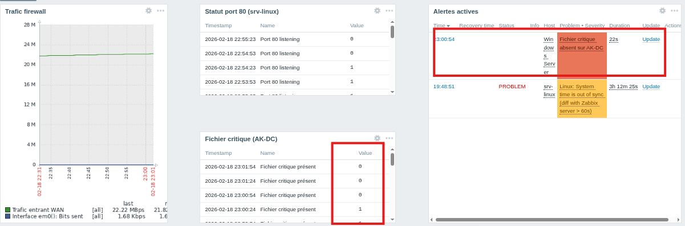
*Figure 27 — Dashboard après suppression du fichier critique : alerte active visible*

```powershell
# Recréer le fichier
New-Item -ItemType File -Path "C:\Supervision\fichier_critique.txt" -Value "Présent"
```

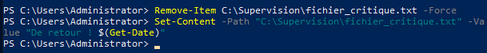
*Figure 28 — Recréation du fichier critique sur AK-DC*

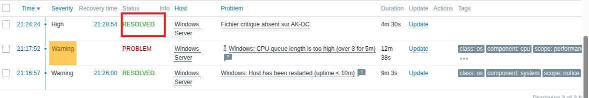
*Figure 29 — Alerte résolue automatiquement après recréation du fichier*


## SIEM Wazuh — Centralisation des logs

### Architecture Wazuh All-in-One

Wazuh a été déployé en mode All-in-One sur `srv-monitoring` (192.168.1.100), ce qui regroupe sur une seule machine les trois composants :

- **Wazuh Manager** : collecte et analyse des événements de sécurité
- **Wazuh Indexer** : indexation et stockage des données (basé sur OpenSearch)
- **Wazuh Dashboard** : interface web de visualisation

### Installation Wazuh (All-in-One)

```bash
curl -sO https://packages.wazuh.com/4.7/wazuh-install.sh
chmod +x wazuh-install.sh
sudo ./wazuh-install.sh --generate-config-files
sudo ./wazuh-install.sh --wazuh-indexer node-1
sudo ./wazuh-install.sh --start-cluster
sudo ./wazuh-install.sh --wazuh-server wazuh-1
sudo ./wazuh-install.sh --wazuh-dashboard dashboard
```

**Récupération du mot de passe admin :**

```bash
sudo tar -O -xvf wazuh-install-files.tar wazuh-install-files/wazuh-passwords.txt
```

**Accès au dashboard :**

```
URL      : https://192.168.1.100
Login    : admin
Password : (récupéré lors de l'installation)
```

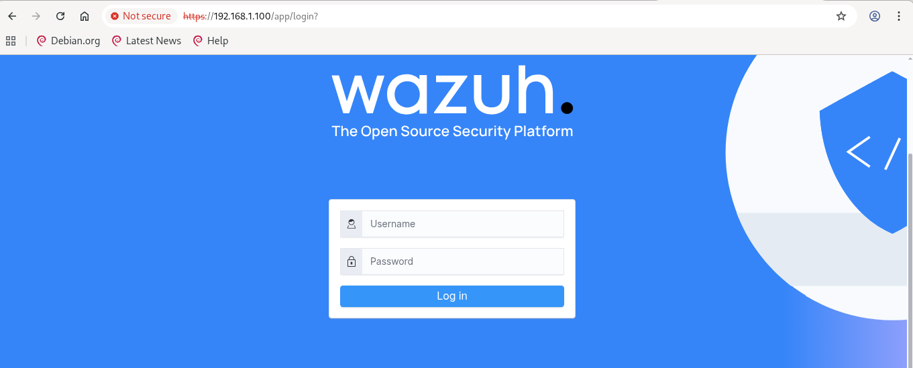
*Figure 30 — Interface web Wazuh Dashboard accessible à `https://192.168.1.100`*

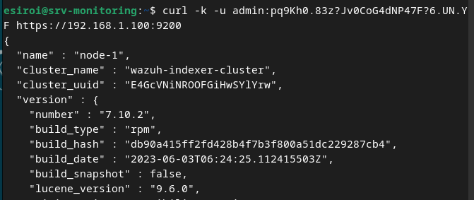
*Figure 31 — Vérification de l'accès HTTPS au dashboard Wazuh via curl*

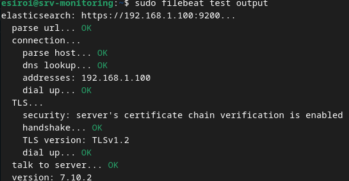
*Figure 32 — Test de la sortie Filebeat confirmant la connexion vers le Wazuh Indexer*

### Agents Wazuh enregistrés

Après l'installation et la configuration des agents sur srv-linux et AK-DC :

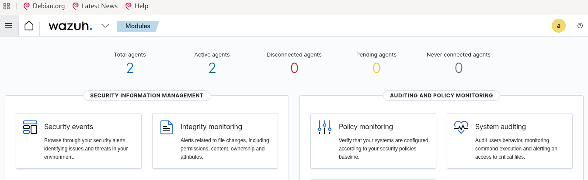
*Figure 33 — Agents Wazuh affichés dans le dashboard*

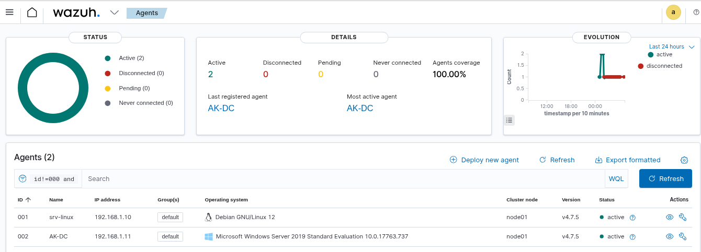
*Figure 34 — Deux agents actifs : srv-linux et AK-DC dans le tableau de bord Wazuh*

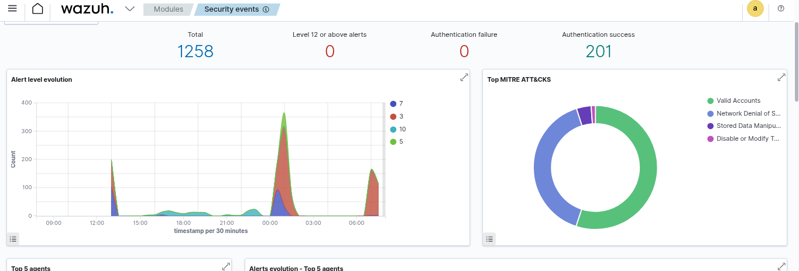
*Figure 35 — Événements de sécurité collectés et affichés dans le dashboard Wazuh*

### Collecte des logs système

Les agents Wazuh collectent automatiquement :

**Sur srv-linux :**
- Logs `/var/log/auth.log` (authentification SSH)
- Logs système `/var/log/syslog`
- Surveillance d'intégrité de fichiers (FIM)

**Sur AK-DC (Windows) :**
- Event Channel System (`eventchannel`)
- Logs d'authentification Windows
- Surveillance Active Directory

Configuration dans `ossec.conf` (AK-DC) :

```xml
<localfile>
  <location>System</location>
  <log_format>eventchannel</log_format>
</localfile>
```

**Depuis pfSense :**
- Logs syslog transmis en UDP/514 vers 192.168.1.100


## Simulation d'une attaque par force brute SSH

### Objectif

Simuler une attaque par dictionnaire sur le service SSH de srv-linux et vérifier que Wazuh détecte et corrèle les événements dans le SIEM.

### Préparation de l'attaque

**Depuis srv-monitoring, installation de l'outil d'attaque :**

```bash
sudo apt update
sudo apt install -y hydra
```

**Création d'un dictionnaire de mots de passe :**

```bash
cat > PASSWD_LIST.txt << EOF
password
123456
admin
root
test
esiroi
debian
wrongpass
badpassword
motdepasse
passtest
lastpass
EOF
```

### Lancement de l'attaque

```bash
sudo hydra -l esiroi -P PASSWD_LIST.txt 192.168.1.10 ssh
```

**Résultat de l'attaque :**

```
[DATA] max 13 tasks per 1 server, overall 13 tasks, 13 login tries (l:1/p:13)
[DATA] attacking ssh://192.168.1.10:22/
1 of 1 target completed, 0 valid password found
```

Hydra n'a pas trouvé le mot de passe correct dans la liste (attendu), mais les tentatives d'authentification ont bien été enregistrées dans les logs de srv-linux.

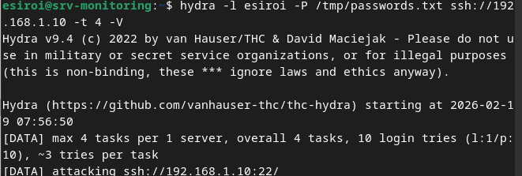
*Figure 36 — Lancement de l'attaque par force brute SSH avec Hydra depuis srv-monitoring*

### Détection par Wazuh

Wazuh a détecté les tentatives de connexion SSH grâce aux règles de corrélation intégrées (règle 5712 — SSH brute force).

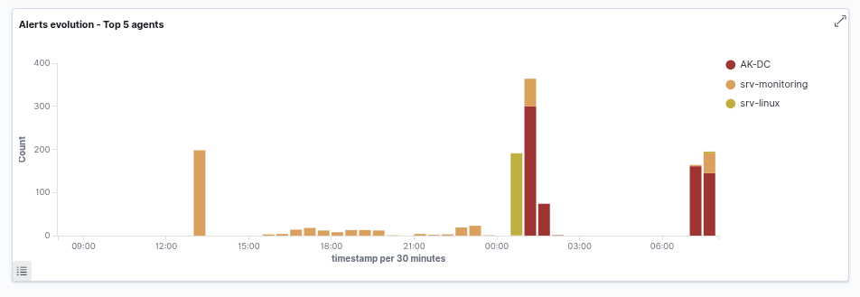
*Figure 37 — Wazuh : Top 5 des attaques détectées — la force brute SSH apparaît en première position*

### Analyse dans le Dashboard Wazuh

Dans le Dashboard Wazuh → **Threat Hunting** → **srv-linux** :

- Augmentation significative des événements "Authentication Failure"
- Corrélation des tentatives multiples depuis la même source (192.168.1.100)
- Classification automatique de l'attaque comme **brute force SSH**
- Règle MITRE ATT&CK associée : **T1110 — Brute Force**

Ce résultat confirme l'efficacité du SIEM pour détecter des attaques en temps réel, même sans intervention manuelle.


## Conclusion

Ce travail pratique a permis de déployer et de valider une infrastructure complète de supervision et de sécurité réseau, intégrant les outils professionnels Zabbix et Wazuh.

### Bilan des réalisations

**Étape 1 — Infrastructure de base :**
- Déploiement de 4 machines virtuelles (srv-monitoring Debian 12, srv-linux Debian 12, AK-DC Windows Server 2019, pfSense 2.7.0)
- Configuration du réseau `192.168.1.0/24` en mode Bridge
- SNMP configuré et validé sur srv-linux et pfSense
- Zabbix Server 6.4 installé avec MariaDB sur srv-monitoring
- Les 3 hôtes cibles supervisés et visibles dans le tableau de bord Zabbix

**Étape 2 — Supervision avancée :**
- Item `net.tcp.listen[80]` configuré sur srv-linux avec déclencheur et alerte testés
- Item `vfs.file.exists` configuré sur AK-DC avec simulation de suppression du fichier critique et validation de l'alerte

**Étape 3 — Centralisation des logs :**
- Wazuh All-in-One installé sur srv-monitoring
- Agents Wazuh déployés sur srv-linux (v4.7.5) et AK-DC (v4.7.5)
- Logs pfSense transmis via syslog UDP/514
- Événements de sécurité collectés et indexés dans le Dashboard Wazuh

**Étape 4 — Simulation d'attaque :**
- Attaque SSH par force brute simulée avec Hydra depuis srv-monitoring vers srv-linux
- Détection automatique par Wazuh et corrélation des événements dans le SIEM
- Classification MITRE ATT&CK validée (T1110 — Brute Force)

### Points techniques notables

- La gestion du réseau via `systemd-networkd` a nécessité de désactiver NetworkManager après l'installation de GNOME pour éviter les conflits.
- L'agent Wazuh sur Windows Server était installé dans le chemin non standard `C:\Program Files (x86)\ossec-agent\` (héritage OSSEC), ce qui a nécessité un diagnostic approfondi.
- Le renommage de l'hôte Windows de `srv-windows` en `AK-DC` dans Zabbix a résolu les erreurs de correspondance de hostname entre l'agent et le serveur.

### Perspectives

Cette infrastructure constitue une base solide pour aller plus loin : mise en place de SNMPv3 (chiffrement et authentification), configuration d'alertes par email, intégration de tableaux de bord personnalisés Grafana, et déploiement d'un système de réponse automatique aux incidents (Active Response Wazuh).


## Références

1. Zabbix SIA, *Documentation officielle Zabbix 6.4*, https://www.zabbix.com/documentation/6.4/
2. Wazuh Inc., *Installation Guide — All-in-One Deployment*, https://documentation.wazuh.com/current/installation-guide/
3. Wazuh Inc., *Blocking SSH Brute Force Attacks*, https://documentation.wazuh.com/current/user-manual/capabilities/active-response/
4. Netgate, *pfSense Documentation*, https://docs.netgate.com/pfsense/en/latest/
5. Debian Project, *Debian GNU/Linux 12 Administrator's Handbook*, https://debian-handbook.info/


*Rapport rédigé par Razafindrabetany Roger Marius — ESIROI 4A Informatique — Promotion 2027*  
*Enseignant responsable : Tommy Montégu*